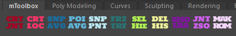

# mToolbox




A collection of personal python based tools for Maya for rigging purposes

## Overview

mToolbox has two modes:
- **UI** (PySide2)
- **Shelf** with separate buttons

Notable functions:
- Create Joint - creates a join chain in +X, editable number of joints, spacing and naming (via UI or command at the end)
- Smarter Create Locator (at selection/at world origin) - creates a locator at your current selection
- Snap To Average - snaps the last selected object to the average of rest of the selection (works both on translation and rotation)
- Point To Average - snaps the last selected object to the average of rest of the selection (works ONLY on translation)
- Snap To Parent (for multiple objects) - snaps all the objects to the first selected (works both on translation and rotation)
- Freeze Transforms - freezes transformation via Freeze Transform command
- Select Hierarchy - selects whole hierarchy of the selected object
- Delete History - deletes history via Delete History -> By Type
- Toggle LRAs - toggles Local Rotation Axis on/off
- Joint ZSO (zero Scale Orientation) - matches rotation axis to translation axis via `joint -e -zso` command
- Make ROM - creates a keyframe each 10 frame starting from 0 up to your current endTime, intended for Range of Movement animation


## Installaton: 
1. Clone or download this repository
2. Copy the `mtoolbox` folder into your `maya/####/scripts/` folder
3. Drag and drop `install_ui.py` (for UI version) or `install_shelf.py` (for shelf version)
4. If UI selected - a new button will appear on your shelf, 
if shelf selected - a new shelf called `mToolbox` with buttons will appear

## Notes: 
- Icons are installed automatically in `maya/####/prefs/icons/mtoolbox`
- Tools are standalone python modules and can be installed one by one via shelfButton command:
```
from mtoolbox.tools.MODULE_NAME import MODULE_NAME 
MODULE_NAME()"
```

## Editing the "Create Joint Chain" Shelf Button
If you're using the shelf option and want to edit the **CRT JNT** button:

Right-click the button -> **EDIT** -> modify the command:
```from mtoolbox.tools.create_joints import create_joints
create_joints(3, 'joint', True)",
```
You can change `create_joints(NUMBER_OF_JOINTS,'NAME', AFFIX)`

NUMBER_OF_JOINTS -> has to be an integer, 1 is the minimum
'NAME' -> can be any string, remember to put it in ''
AFFIX -> `True` or `False`

## Credits

- Toolbox icon made by [Adib Sulthon](https://www.flaticon.com/free-icons/toolbox) - [Flaticon](https://www.flaticon.com/)
